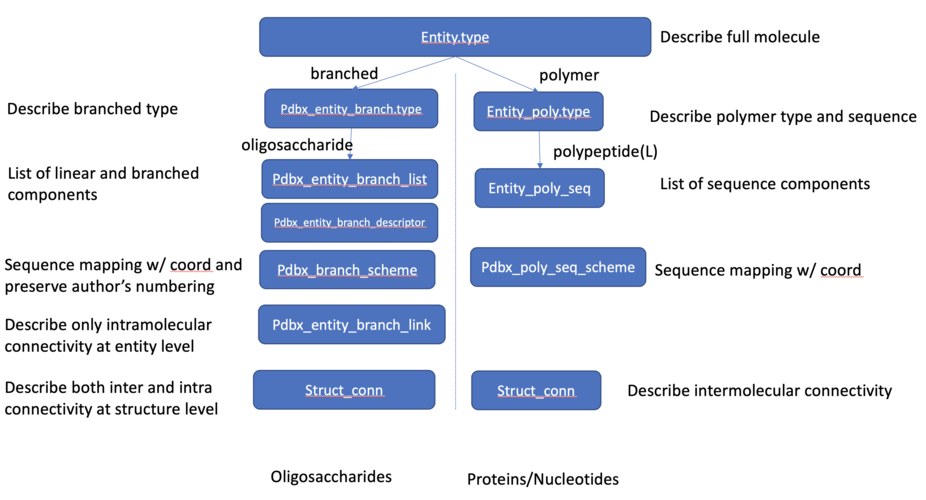
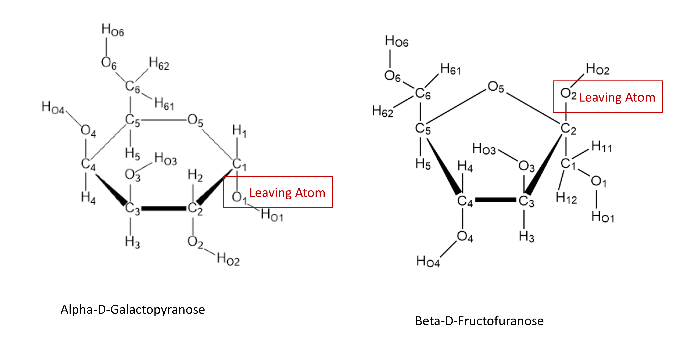

# Carbohydrate Remediation Project at the PDB

The Protein Data Bank (PDB) Core Archive is jointly managed by the [wwPDB partnership](https://wwpdb.org). As the archive grows and science evolves, the 3D structures that are represented in the PDB Core Archive requires ongoing improvement (“remediation”) to ensure consistency, accuracy, and overall quality of the PDB archive. While numerous tools exist to curate protein 3D structural data, few have been developed for consistent standard representation and for checking the veracity of carbohydrate 3D structural data within wwPDB deposition-validation-biocuration processes. The RCSB Protein Data Bank, a Core wwPDB Member, has been collaborating with [Complex Carbohydrate Research Center](https://www.ccrc.uga.edu) to develop and implement innovative tools to facilitate identification, quality assessment, and standard representation of carbohydrate structures in the PDB Core Archive. For the avoidance of doubt, this work is being carried out as part of an overall wwPDB strategy to remediate various aspects of the PDB Core Archive. Working with the glycoscience community, carbohydrate-appropriate annotation tools are being developed and implemented within the wwPDB OneDep unified system for deposition, validation, and biocuration of structures coming into the PDB Core Archive. These software tools will provide standard nomenclature and consistent oligosaccharide representation that can be easily translated to other representations commonly used by glycobiologists.

This effort will involve the following steps: (1) standardizing sugar nomenclature following IUPAC/IUBMB; (2) providing a uniform polymer representation for polysaccharides with appropriate descriptor(s); (3) adopting community software for reliable carbohydrate identification, assignment of standard nomenclature, and detection of intra/inter-molecular connectivity between monosaccharides and other molecules/proteins; and (4) providing intra- and inter-molecular connectivity at atom level explicitly. Due to the nature of carbohydrates, which are usually branched and/or have different glycosidic linkages, additional data descriptors will be introduced into the PDBx/mmCIF dictionary to describe new representation of oligosaccharides as branched entities. The branch components (monosaccharides) and their intramolecular linkages, as well as the glycosidic bonds, will be explicitly listed. The proposed PDBx/mmCIF dictionary extensions and some examples of how PDB Core Archive structures containing carbohydrates would be represented in PDBx/mmCIF format and the corresponding proposed Chemical Component Dictionary definitions are provided herein.

Each oligosaccharide molecule will be classified as a branched entity at entity.type data item, identified as oligosaccharide type at `_pdbx_entity_branch.type` data item, and assigned a unique chain ID in `_atom_site.auth_asym_id` data item. The monosaccharides constituting an oligosaccharide entity will be listed in the `_pdbx_entity_branch_list` category. Unlike polypeptides, where the peptidic bond is implicitly assumed, the connectivity of the glycosidic bond for an oligosaccharide entity is explicitly described at the entity level in `_pdbx_entity_branch_link` category so that users can retrieve an oligosaccharide entity with correct linkages. 


*Figure 1: Oligosaccharide representation compared to protein/nucleic acid representation, branched vs polymer.*

For example, the oligosaccharide, Lewis Y blood group antigen with components 
(FUC)-NAG-GAL-FUC in PDB entry 2WMG will be represented as below branched entity.

```
#
_entry.id   2WMG 
# 
loop_ 
_entity.id  
_entity.type  
_entity.src_method  
_entity.pdbx_description  
_entity.formula_weight  
_entity.pdbx_number_of_molecules  
_entity.details  
_entity.pdbx_mutation  
_entity.pdbx_fragment  
_entity.pdbx_ec 
1 polymer  man 'FUCOLECTIN-RELATED PROTEIN' 66769.758 1   ? YES 'CATALYTIC MODULE, RESIDUES 31-589' ? 
2 branched man (Fuc(a1-2)Gal(b1-4)[Fuc(a1-3)]GlcNAc(b1-   729.676 1 ? ? ? ? 
3 water    nat water                        18.015    334 ? ? ? ? 
# 
_pdbx_entity_branch.entity_id   2
_pdbx_entity_branch.type         oligosaccharide
#
loop_
_pdbx_entity_branch_list.entity_id
_pdbx_entity_branch_list.num
_pdbx_entity_branch_list.comp_id
_pdbx_entity_branch_list.hetero
2 1  NAG   n
2 2  GAL   n
2 3  FUC   n 
2 4  FUC   n
#
loop_
_pdbx_entity_branch_link.link_id 
_pdbx_entity_branch_link.entity_id
_pdbx_entity_branch_link.entity_branch_list_num_1
_pdbx_entity_branch_link.comp_id_1
_pdbx_entity_branch_link.atom_id_1
_pdbx_entity_branch_link.leaving_atom_id_1
_pdbx_entity_branch_link.atom_stereo_config_1
_pdbx_entity_branch_link.entity_branch_list_num_2
_pdbx_entity_branch_link.comp_id_2
_pdbx_entity_branch_link.atom_id_2
_pdbx_entity_branch_link.leaving_atom_id_2
_pdbx_entity_branch_link.atom_stereo_config_2
_pdbx_entity_branch_link.value_order
_pdbx_entity_branch_link.details
1 2 1 NAG O4 O1 R 2 GAL C1 O1 R sing ?
2 2 2 GAL O2 O1 R 3 FUC C1 O1 R sing ?
3 2 1 NAG O3 O1 R 4 FUC C1 O1 R sing ?
#
```

To minimize impact to PDB Core Archive users, the current `_struct_conn` that describes connectivity at structure level will remain as is, with extension to explicitly describe the leaving atom and its stereochemical configuration. (N.B.: Oligosaccharides are not represented in `_entity_poly_seq`, hence sequential sequence numbering in `_atom_site.label_seq_id` will be null). Based on community feedback, the glycosylation site and its binding type (N-linked glycan or O-linked glycan) needs to be identified in a machine readable format in order to be easily parsed by users. The item `_struct_conn.pdbx_role` is used for binding site and is a controlled vocabulary.  


For example, the glycosylation sites are identified in `_struct_conn.pdbx_role` for PDB entry 4OF3.

```
loop_
_struct_conn.id
_struct_conn.conn_type_id 
_struct_conn.pdbx_leaving_atom_flag 
_struct_conn.ptnr1_label_comp_id 
_struct_conn.ptnr1_label_asym_id 
_struct_conn.ptnr1_label_seq_id 
_struct_conn.ptnr1_label_atom_id 
_struct_conn.pdbx_ptnr1_label_alt_id 
_struct_conn.pdbx_ptnr1_PDB_ins_code 
_struct_conn.pdbx_ptnr1_standard_comp_id 
_struct_conn.pdbx_ptnr1_leaving_atom_id
_struct_conn.pdbx_ptnr1_atom_stereo_config
_struct_conn.ptnr1_symmetry 
_struct_conn.ptnr2_label_comp_id 
_struct_conn.ptnr2_label_asym_id 
_struct_conn.ptnr2_label_seq_id 
_struct_conn.ptnr2_label_atom_id 
_struct_conn.pdbx_ptnr2_label_alt_id 
_struct_conn.pdbx_ptnr2_PDB_ins_code 
_struct_conn.pdbx_ptnr2_standard_comp_id 
_struct_conn.pdbx_ptnr2_leaving_atom_id
_struct_conn.pdbx_ptnr2_atom_stereo_config
_struct_conn.ptnr2_symmetry 
_struct_conn.pdbx_role 
_struct_conn.pdbx_dist_value 
_struct_conn.pdbx_value_order 
_struct_conn.details  
covale1  covale Y ASN A 93  ND2 ? ? ? OXT N 1_555  NAG C 801 C1 ? ? ? O1 R 1_555  Glycosylation 1.438 sing ?
covale2  covale Y ASN A 206 ND2 ? ? ? OXT N 1_555  NAG D 804 C1 ? ? ? O1 R 1_555  Glycosylation 1.415 sing ?
covale3  covale Y ASN B 93  ND2 ? ? ? OXT N 1_555  NAG E 801 C1 ? ? ? O1 R 1_555  Glycosylation 1.434 sing ?
#
```

The linear sequence descriptor of an oligosaccharide based on observed sequence will be described in `_pdbx_entity_descriptor` category so that it is interoperable with various representations that are used in the glycoscience community.  

For example, the linear sequence descriptor for the oligosaccharide, (FUC)-NAG-GAL-FUC, is described in `_pdbx_entity_descriptor.descriptor` for PDB entry 2WMG.

```
#
loop_
_pdbx_entity_descriptor.ordinal
_pdbx_entity_descriptor.entity_id
_pdbx_entity_descriptor.descriptor
_pdbx_entity_descriptor.type
_pdbx_entity_descriptor.program
_pdbx_entity_descriptor.program_version
1  2 Fuc(a1-2)Gal(b1-4)[Fuc(a1-3)]GlcNAc(b1-  'Glycam Condensed Sequence' Gems 1.0
2  2 Fuc(a1-2)Gal(b1-4)[Fuc(a1-3)]GlcNAc      'Glycam Condensed Sequence' Gems 1.0
3  2 [][b-D-GlcpNAc]{[(3+1)][a-L-Fucp]{}[(4+1)][b-D-Galp]{[(2+1)][a-L-Fucp]{}}}  LINUCS PDB-CARE Beta
#
```

In addition, we will standardize wwPDB Chemical Component Dictionary (CCD) so that all sugars are represented as monosaccharides with IUPAC style residue naming and standard atom nomenclature following IUPAC-IUBMB. For pyranoses, the leaving atom is O1, while for furanoses and sialic acid derivatives, the leaving atom is O2. These standardized atom nomenclatures will facilitate systematic numbering of components in oligosaccharides and also in validation of carbohydrate structures. 


*Figure 2: Standard atom nomenclature of pyranose and furanose ring sugars.*

To support findability, wwPDB will preserve the commonly used names for oligosaccharides through extending an existing reference dictionary of biologically interesting molecules. To minimize the impact on the coordinate section (atom_site) of the PDB Core Archive files and on other software used in the field such as refinement programs or 3D visualization tools, the three letter code residue names will be retained in `_atom_site.label_comp_id`. We will introduce IUPAC style naming using existing data item, `_pdbx_chem_comp_identifier` in the CCD for consistent annotation in the PDB Core Archive atomic coordinate files. This information will be copied to the PDB Core Archive atomic coordinate files as a metadata.

For example, the IUPAC style naming b-D-GlcpNAc or GlcpNAc or N-acetyl-beta-D-glucosamine for NAG are provided with source provenance identified.

```
# 
loop_
_pdbx_chem_comp_identifier.comp_id 
_pdbx_chem_comp_identifier.type 
_pdbx_chem_comp_identifier.program 
_pdbx_chem_comp_identifier.program_version 
_pdbx_chem_comp_identifier.identifier 
NAG "SYSTEMATIC NAME"             ACDLabs              12.01 "2-(acetylamino)-2-deoxy-beta-D-glucopyranose"                                   
NAG "SYSTEMATIC NAME"             "OpenEye OEToolkits" 1.7.6 "N-[(2R,3R,4R,5S,6R)-6-(hydroxymethyl)-2,4,5-tris(oxidanyl)oxan-3-yl]ethanamide" 
NAG "CONDENSED IUPAC CARB SYMBOL" Gems  1.0  GlcpNAc
NAG "IUPAC CARB SYMBOL"           Gems  1.0  b-D-GlcpNAc
NAG "COMMON NAME"                 ChEBI 1.0  N-acetyl-beta-D-glucosamine
```

We will take this opportunity to improve management of synonyms in the wwPDB CCD during this remediation. We will move synonym list out of `_chem_comp.pdbx_synonyms` to a better organized table structure, `_pdbx_chem_comp_synonyms` with source provenance.

For example, each synonym is listed at each row with data source identified for ligands ROC and for 58A. 

```
#
loop_
_pdbx_chem_comp_synonyms.comp_id
_pdbx_chem_comp_synonyms.name 
_pdbx_chem_comp_synonyms.provenance
ROC  Fortovase       DRUGBANK
ROC  SAQUINAVIR      DRUGBANK
ROC  "RO 31-8959"    ?
#
loop_
_pdbx_chem_comp_synonyms.comp_id
_pdbx_chem_comp_synonyms.name 
_pdbx_chem_comp_synonyms.provenance
58A cytidinediphosphate-dioleoylglycerol PUBCHEM
58A CDP-1,2-dioleoyl-sn-glycerol         CHEBI
```

Based on the feedback from glycoscience community, the relationship between a modified monosaccharide and its core structure (standard monosaccharide) is described in `_pdbx_chem_comp_related category` and the atom-to-atom mapping is provided in `_pdbx_chem_comp_atom_related` category.

For example, the core structure for modified monosaccharide, SGN is GLC with "carbohydrate core" identified as relationship type.

```
# 
_pdbx_chem_comp_related.comp_id            SGN
_pdbx_chem_comp_related.related_comp_id    GLC
_pdbx_chem_comp_related.relationship_type  'Carbohydrate core'
_pdbx_chem_comp_related.details            ?
#
loop_      
_pdbx_chem_comp_atom_related.ordinal
_pdbx_chem_comp_atom_related.comp_id
_pdbx_chem_comp_atom_related.atom_id
_pdbx_chem_comp_atom_related.related_comp_id
_pdbx_chem_comp_atom_related.related_atom_id
_pdbx_chem_comp_atom_related.related_type
 1 SGN C1    GLC C1   'Carbohydrate core'
 2 SGN C2    GLC C2   'Carbohydrate core'
 3 SGN C3    GLC C3   'Carbohydrate core'
 4 SGN C4    GLC C4   'Carbohydrate core'
 5 SGN C5    GLC C5   'Carbohydrate core'
 6 SGN C6    GLC C6   'Carbohydrate core'
 7 SGN N     GLC ?    'Carbohydrate core'
 8 SGN O1    GLC O1   'Carbohydrate core'
 9 SGN O3    GLC O3   'Carbohydrate core'
10 SGN O4    GLC O4   'Carbohydrate core'
11 SGN O5    GLC O5   'Carbohydrate core'
12 SGN O6    GLC O6   'Carbohydrate core'
13 SGN S1    GLC ?    'Carbohydrate core'
14 SGN O1S   GLC ?    'Carbohydrate core'
15 SGN O2S   GLC ?    'Carbohydrate core'
16 SGN O3S   GLC ?    'Carbohydrate core'
17 SGN S2    GLC ?    'Carbohydrate core'
18 SGN O4S   GLC ?    'Carbohydrate core'
19 SGN O5S   GLC ?    'Carbohydrate core'
20 SGN O6S   GLC ?    'Carbohydrate core'
21 SGN H1    GLC H1   'Carbohydrate core'
22 SGN H2    GLC H2   'Carbohydrate core'
23 SGN H3    GLC H3   'Carbohydrate core'
24 SGN H4    GLC H4   'Carbohydrate core'
25 SGN H5    GLC H5   'Carbohydrate core'
26 SGN H61   GLC H61  'Carbohydrate core'
27 SGN H62   GLC H62  'Carbohydrate core'
28 SGN HN    GLC ?    'Carbohydrate core'
29 SGN HO1   GLC HO1  'Carbohydrate core'
30 SGN HO3   GLC HO3  'Carbohydrate core'
31 SGN HO4   GLC HO4  'Carbohydrate core'
32 SGN HOS3  GLC ?    'Carbohydrate core'
33 SGN HOS6  GLC ?    'Carbohydrate core'
#
```

Due to significant changes made to the CCD to support carbohydrate remediation, the enhanced CCD will be versioned and provided at versioned FTP ([ftp://ftp-versioned.wwpdb.org](ftp://ftp-versioned.wwpdb.org)) with better organization in the revision history which was already implemented in the atomic coordinate files. The main FTP archive will have the latest version of CCD, while every latest major version will be provided at versioned FTP archive. 

For example, the revision history for chemical component, MAN is captured in `_pdbx_audit_revision_history` and the existing mmCIF categories in the CCD that were updated during this remediation are listed in `_pdbx_audit_revision_category`.

```
#
loop_
_pdbx_audit_revision_history.ordinal             
_pdbx_audit_revision_history.data_content_type    
_pdbx_audit_revision_history.major_revision       
_pdbx_audit_revision_history.minor_revision       
_pdbx_audit_revision_history.revision_date       
1 'Chemical component' 1 0 1999-07-08
2 'Chemical component' 1 1 2011-06-04
3 'Chemical component' 2 0 2018-10-17
#
loop_
_pdbx_audit_revision_details.ordinal              
_pdbx_audit_revision_details.revision_ordinal     
_pdbx_audit_revision_details.data_content_type   
_pdbx_audit_revision_details.provider             
_pdbx_audit_revision_details.type                
_pdbx_audit_revision_details.description          
1 1 'Chemical component' repository 'Initial release' ?
# 
loop_
_pdbx_audit_revision_category.ordinal             
_pdbx_audit_revision_category.revision_ordinal     
_pdbx_audit_revision_category.data_content_type   
_pdbx_audit_revision_category.category             
1 3 'Chemical component' '_chem_comp'
2 3 'Chemical component' '_chem_comp_atom'
3 3 'Chemical component' '_pdbx_chem_comp_synonyms'
4 3 'Chemical component' '_pdbx_chem_comp_identifier'
#
```

We plan the rollout of new representation of carbohydrate structures to the PDB Core Archive in the early 2020. The data representation is a result of consultation with glycoscience community and the wwPDB PDBx/mmCIF Working Group via discussions with key stakeholders at annual carbohydrate/glycobiology and recurring Working Group meetings. A more substantial collection of example files of remediated data representing various use cases will be provided for testing and adoption by the glycoscience community, refinement software developers, cheminformaticians, and 3D visualization key stakeholders during the development stage. 

## Acknowledgements

The carbohydrate remediation project is a wwPDB collaborative project that is carried out principally by [RCSB PDB](https://www.rcsb.org/) at Rutgers, The State University of New Jersey and is funded by NIGMS grant U01 CA221216 in collaboration with [Complex Carbohydrate Research Center](https://www.ccrc.uga.edu) at the University of Georgia.

